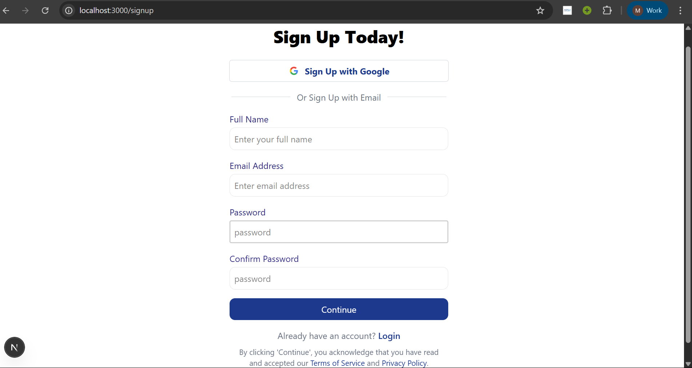
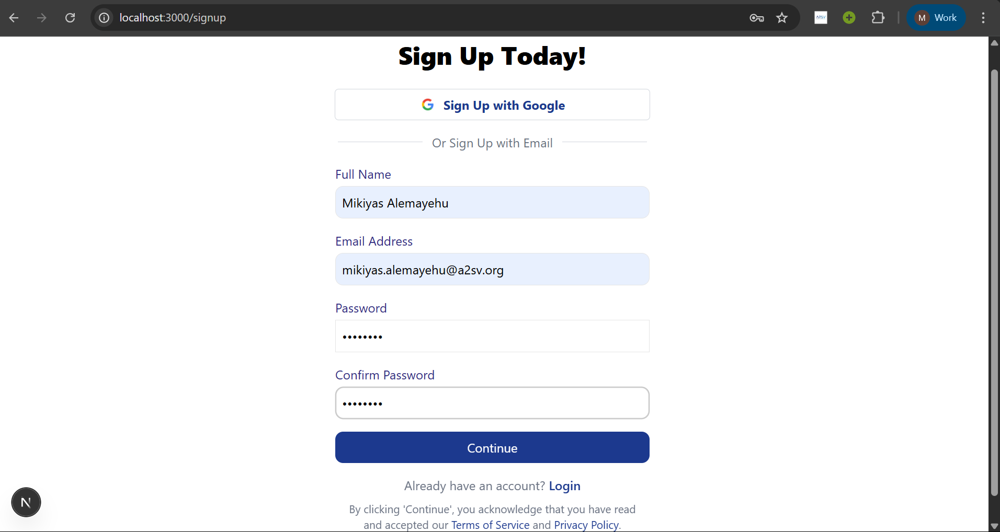
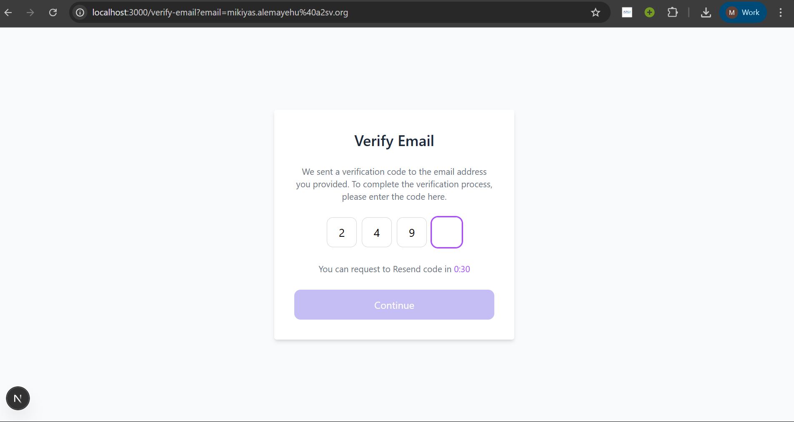
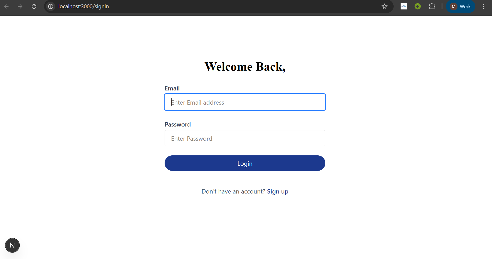

# Task 8: User Authentication

This project implements authentication functionality using **NextAuth.js** in a **Next.js** application. It includes dedicated **signup**, **signin**, and **OTP verification** pages, and integrates with provided backend API endpoints for registration and login.

---

## 🔧 Features

- Separate pages for **Signup**, **Signin**, and **Verify Email (OTP)**
- Integration with external API endpoints
- Secure handling of user data and tokens
- Client-side input validation
- Error handling with user feedback
- Clean and accessible UI (based on provided Figma design)

---

## 📸 Screenshots

> Below are the screenshots of each major page with brief descriptions:

### 📝 Signup Page




- Fields: Name, Email, Password, Confirm Password, Role
- Client-side validations for required fields and password match
- Submits a POST request to `/signup`

---

### 🔐 Verify Email (OTP) Page



- Enter OTP to verify the email
- Submits POST request to `/verify-email`

---

### 🔑 Signin Page



- Fields: Email, Password
- Submits a POST request to `/login`
- Stores the access token on success

---

## 🌐 API Integration

**Base URL**: `https://akil-backend.onrender.com/`


This is a [Next.js](https://nextjs.org) project bootstrapped with [`create-next-app`](https://nextjs.org/docs/app/api-reference/cli/create-next-app).

## Getting Started
✅ How to Run
1. Clone the repo:

    git clone (https://github.com/mikiyasalemayehu-mekonen/a2sv-web-internship)
    cd auth-app

2. Install dependencies:
    npm install
3. Run the app:

```bash
npm run dev
# or
yarn dev
# or
pnpm dev
# or
bun dev
```

Open [http://localhost:3000](http://localhost:3000) with your browser to see the result.

You can start editing the page by modifying `app/page.tsx`. The page auto-updates as you edit the file.

This project uses [`next/font`](https://nextjs.org/docs/app/building-your-application/optimizing/fonts) to automatically optimize and load [Geist](https://vercel.com/font), a new font family for Vercel.

## Learn More

To learn more about Next.js, take a look at the following resources:

- [Next.js Documentation](https://nextjs.org/docs) - learn about Next.js features and API.
- [Learn Next.js](https://nextjs.org/learn) - an interactive Next.js tutorial.

You can check out [the Next.js GitHub repository](https://github.com/vercel/next.js) - your feedback and contributions are welcome!

## Deploy on Vercel

The easiest way to deploy your Next.js app is to use the [Vercel Platform](https://vercel.com/new?utm_medium=default-template&filter=next.js&utm_source=create-next-app&utm_campaign=create-next-app-readme) from the creators of Next.js.

Check out our [Next.js deployment documentation](https://nextjs.org/docs/app/building-your-application/deploying) for more details.
