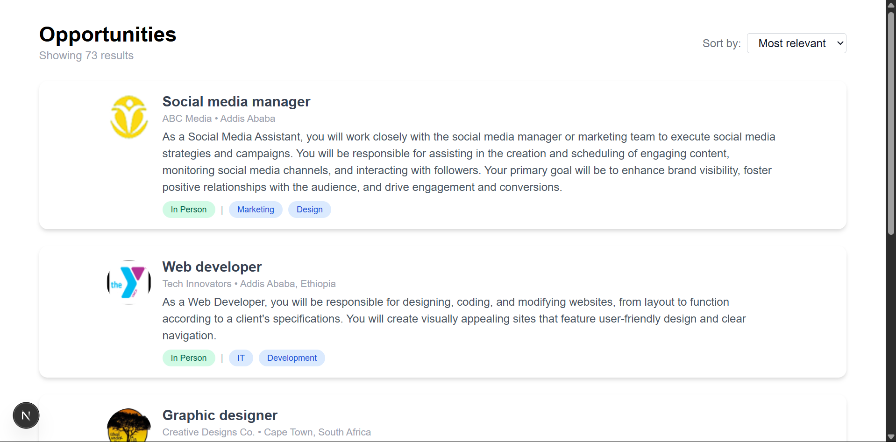

# 🧑‍💼 Job Listing Application 

This project is part of a series aimed at developing a full-featured job listing web application using React and Tailwind CSS.  The objective is to create a visually accurate and functional Job Card component and an Applicants Dashboard using dummy data and a provided UI design.


## 📌 Task Overview

Objective:
Build a Job Card component and a Dashboard UI based on the provided Figma design, populate it with JSON data, and integrate avatar images using Tailwind CSS for styling.


## ✅ Features Implemented

- ✅ Functional React card component created
- ✅ Dummy data populated into card fields (name, title, description)
- ✅ Avatar image integrated into the card
- ✅ Dashboard page built and styled using Tailwind CSS
- ✅ Layout and styling follow the provided Figma UI
- ✅ Clean and organized code structure
- ✅ Screenshots provided for all major components/pages


### 📊 Dashboard View



This is a [Next.js](https://nextjs.org) project bootstrapped with [`create-next-app`](https://nextjs.org/docs/app/api-reference/cli/create-next-app).

## Getting Started

First, run the development server:

```bash
npm run dev
# or
yarn dev
# or
pnpm dev
# or
bun dev
```

Open [http://localhost:3000](http://localhost:3000) with your browser to see the result.

You can start editing the page by modifying `app/page.tsx`. The page auto-updates as you edit the file.

This project uses [`next/font`](https://nextjs.org/docs/app/building-your-application/optimizing/fonts) to automatically optimize and load [Geist](https://vercel.com/font), a new font family for Vercel.

## Learn More

To learn more about Next.js, take a look at the following resources:

- [Next.js Documentation](https://nextjs.org/docs) - learn about Next.js features and API.
- [Learn Next.js](https://nextjs.org/learn) - an interactive Next.js tutorial.

You can check out [the Next.js GitHub repository](https://github.com/vercel/next.js) - your feedback and contributions are welcome!

## Deploy on Vercel

The easiest way to deploy your Next.js app is to use the [Vercel Platform](https://vercel.com/new?utm_medium=default-template&filter=next.js&utm_source=create-next-app&utm_campaign=create-next-app-readme) from the creators of Next.js.

Check out our [Next.js deployment documentation](https://nextjs.org/docs/app/building-your-application/deploying) for more details.
