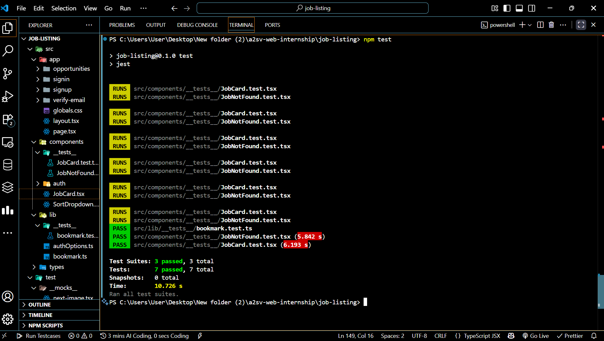

# Job Listing Application with Bookmark Functionality

A web application for browsing job positions, with the ability for users to bookmark their favorite jobs.


## Table of Contents
- [Features](#features)
- [Technologies](#technologies)
- [Installation](#installation)
- [Usage](#usage)
- [Testing](#testing)
- [Screenshots](#screenshots)
- [Folder Structure](#folder-structure)
- [API Endpoints](#api-endpoints)
- [Contributing](#contributing)
- [License](#license)

---


## Features
- Browse job positions with title, company, location, and type.
- Bookmark toggle button on each job card.
- Bookmarking restricted to authenticated users.
- Search job positions by title.
- Unit, component, and end-to-end testing using Jest and Cypress.

---

## Technologies
- **Frontend:** React, Next.js, Tailwind CSS
- **Authentication:** NextAuth.js
- **Testing:** Jest, React Testing Library, Cypress
- **Icons:** react-icons
- **Backend API:** [Akil Backend](https://akil-backend.onrender.com)

---

## Installation

    1. **Clone the repository**
    ```bash
    git clone https://github.com/mikiyasalemayehu-mekonen/a2sv-web-internship
    cd job-listing

    2 **Install dependencies**
    ```bash
    npm install
    3 **Set environment variables**
        Create a .env.local file in the root and add:
        NEXTAUTH_URL=http://localhost:3000
        NEXTAUTH_SECRET=<your-secret>

    4 **Start the development server**
    ```bash
        npm run dev
        Visit http://localhost:3000 to see the app.
## Usage
    Register a new user (role should be user).
    Browse job positions on the dashboard.
    Click the bookmark icon on a job card to save or remove it.
    Bookmarked jobs appear in the saved/bookmarked list.

## Testing
    Unit and Component Testing (Jest)
    ```bash
        npm test
    Validates bookmark toggle functionality.
    Ensures JobCard and JobNotFound components render correctly.

    End-to-End Testing (Cypress)
    ```bash
        npx cypress open
    Tests bookmark functionality from a user perspective.
    Simulates interactions like bookmarking, unbookmarking, and authentication flow.
    ⚠️ Make sure the development server is running (npm run dev) before running Cypress tests.

## Screenshots
  1. Dashboard with Job Cards and with bookmark button
    

  2.login page
    

  3.signup page
    

  4. verify-email page
    

  5. details.page
    

  6. Jest Test
    

  7. CYPRESS Test
    

    


## Folder Structure
        job-listing-app/
    ├─ public/
    │  ├─ images/
    │  └─ favicon.ico
    ├─ screenshots/         
    ├─ src/
       |─ app/
    │  │  ├─ api
    │  │  └─ dashboard
       | └─opportunity
          └─signin
          └─signup
          └─verify-email
    │  ├─ components/
    │  │  ├─ JobCard.tsx
    │  │  └─ JobNotFound.tsx
    │  ├─ lib/
    │  │  └─ bookmark.ts
    │  ├─ pages/
    │  │  ├─ dashboard.tsx
    │  │  └─ api/
    │  └─ styles/
    ├─ .env.local
    ├─ package.json
    ├─ jest.config.js
    └─ cypress/
        ├─ e2e/
    │    └─ bookmark.cy.ts
    └─ support/
    Base URL: https://akil-backend.onrender.com/
## API Endpoints

    Action	             Endpoint	         Method	  Notes
    Get all bookmarks	/bookmarks	          GET	  Retrieves all bookmarked jobs
    Create a bookmark	/bookmarks/:eventID	  POST	  Empty body
    Remove a bookmark	/bookmarks/:eventID	  DELETE	-

## Contributing
    Fork the repository
    Create a feature branch: git checkout -b feature/my-feature
    Commit changes: git commit -m "Add my feature"
    Push: git push origin feature/my-feature
    Open a pull request

## License
    This project is licensed under the MIT License.


This is a [Next.js](https://nextjs.org) project bootstrapped with [`create-next-app`](https://nextjs.org/docs/app/api-reference/cli/create-next-app).

## Getting Started

First, run the development server:

```bash
npm run dev
# or
yarn dev
# or
pnpm dev
# or
bun dev
```

Open [http://localhost:3000](http://localhost:3000) with your browser to see the result.

You can start editing the page by modifying `app/page.tsx`. The page auto-updates as you edit the file.

This project uses [`next/font`](https://nextjs.org/docs/app/building-your-application/optimizing/fonts) to automatically optimize and load [Geist](https://vercel.com/font), a new font family for Vercel.

## Learn More

To learn more about Next.js, take a look at the following resources:

- [Next.js Documentation](https://nextjs.org/docs) - learn about Next.js features and API.
- [Learn Next.js](https://nextjs.org/learn) - an interactive Next.js tutorial.

You can check out [the Next.js GitHub repository](https://github.com/vercel/next.js) - your feedback and contributions are welcome!

## Deploy on Vercel

The easiest way to deploy your Next.js app is to use the [Vercel Platform](https://vercel.com/new?utm_medium=default-template&filter=next.js&utm_source=create-next-app&utm_campaign=create-next-app-readme) from the creators of Next.js.

Check out our [Next.js deployment documentation](https://nextjs.org/docs/app/building-your-application/deploying) for more details.
