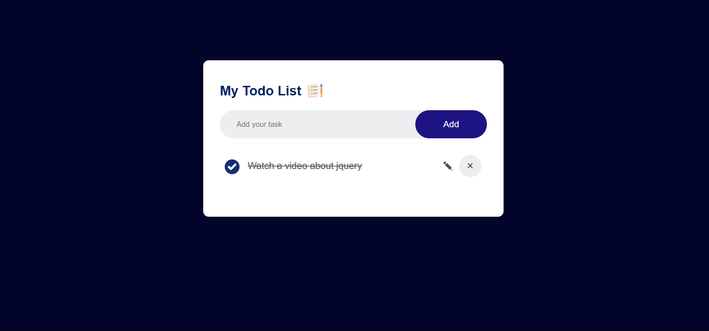
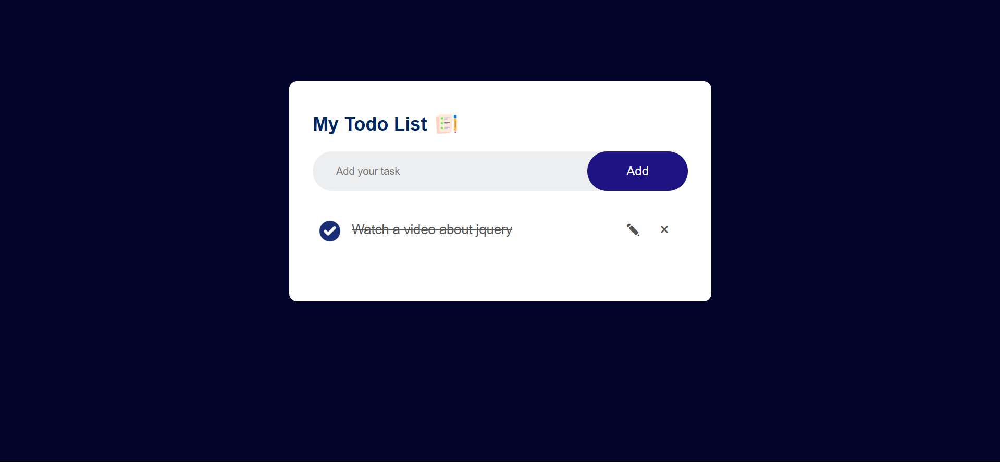

# Task 1 - Todo List App ✅

This is a simple Todo List web application built using **HTML**, **CSS**, and **JavaScript** as part of the A2SV Web Internship program.

## 🔧 Features

- Add tasks ✅  
- Edit tasks ✏️  
- Delete tasks (click once) ❌  
- Mark tasks as completed ☑️

## 🚀 Getting Started

1. Clone the repo:
  git clone https://github.com/mikiyasalemayehu-mekonen/a2sv-web-internship

3. Navigate to "task1-todo-list-app"

4. Open "index.html" in a browser

## 📸 Screenshots

### Main Page

### Edit Mode

### Delete Confirm

### Task Checked / Completed
 

## 📁 Folder Structure
  task1-todo-list-app/
  ├── index.html
  ├── images
  ├── style.css
  ├── script.js
  └── README.md
  

## 📎 Link
[GitHub Repo](https://github.com/mikiyasalemayehu-mekonen/a2sv-web-internship/tree/main/task1-todo-list-app)

