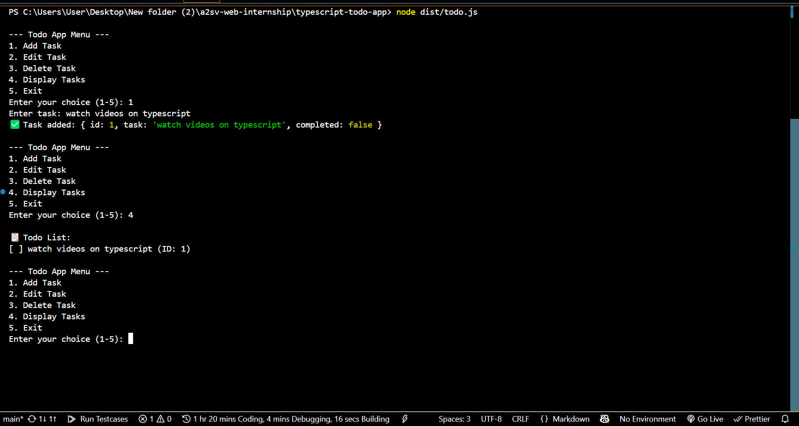
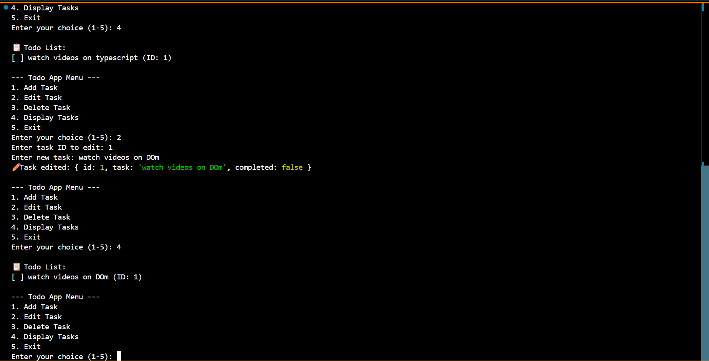
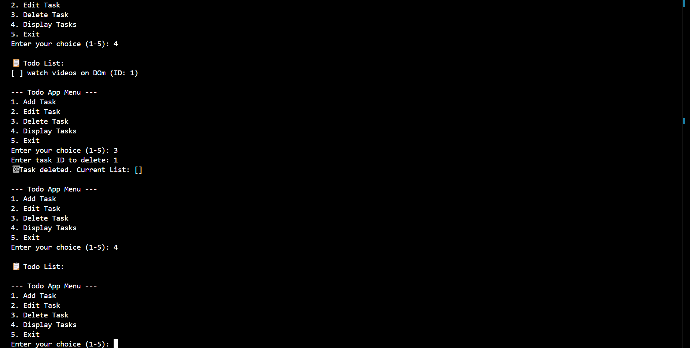

# 📝 Todo List App (TypeScript)

## 📌 Description
A simple command-line todo list application built using TypeScript for the A2SV Web Internship Task 2.

## 🔧 Features
- ✅ Add tasks
- ✏️ Edit tasks
- ❌ Delete tasks
- 📋 Display tasks

## 🚀 How to Run

1. Clone the Repository
   git clone https://github.com/YOUR_USERNAME/typescript-todo-app.git
   cd typescript-todo-app

2. Install Node.js & TypeScript
   npm install
   npm install -g typescript

3. Compile the TypeScript file:
   tsc todo.ts

4. Run the Compiled JavaScript
   node dist/todo.js 

## Screenshots

### ➕ Add Tasks

### ✏️ Edit Task

### ❌ Delete Task

### 📋 Display Tasks

## 🪪 License

This project is licensed under the MIT License.

